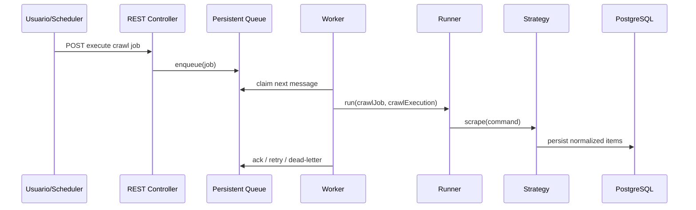
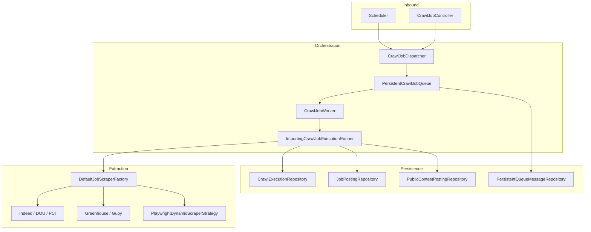

# WebScraper Java

Plataforma backend em Java 21 + Spring Boot para coleta, normalizacao, persistencia e consulta de
vagas privadas e concursos publicos, com prioridade absoluta para fontes API-first e fallback
controlado para scraping HTML ou browser somente quando permitido.

O projeto foi construido com TDD e evoluido por iteracoes documentadas em ADRs e story logs. Hoje
ele ja cobre fontes oficiais/publicas, fontes ATS, scraping HTML estatico, fallback dinamico com
Playwright e execucao assíncrona com fila persistida.

## Fluxo Oficial de Entrega

Toda nova task deve seguir este fluxo, sem pular etapas:

1. verificar se a task esta coerente com o projeto atual, ADRs, stories, commits recentes e
   `README.md`;
2. escrever ou ajustar os testes primeiro, seguindo Extreme Programming e o ciclo Red → Green →
   Refactor;
3. implementar a feature ate os testes automatizados relevantes ficarem verdes;
4. executar tambem validacao real com a aplicacao rodando, para observar erros de runtime,
   integracao e comportamento operacional;
5. somente depois de testes aprovados enviar para review;
6. somente depois da review aprovada fazer `commit` e `push` para `main`;
7. antes do `push`, sincronizar codigo, ADRs, stories/tasks, `README.md` e mensagem de commit.

Regra operacional atual de testes:

- nao depender de Testcontainers como gate de entrega da equipe;
- priorizar fixtures, testes unitarios, testes de integracao controlados no proprio projeto e
  validacao real com a aplicacao em execucao;
- quando houver referencias antigas a Testcontainers nos ADRs ou stories, trate isso como contexto
  historico, nao como obrigacao do fluxo atual.

## Objetivos

- Coletar vagas de tecnologia e concursos publicos com foco pratico em Java / Spring Boot.
- Priorizar fontes de menor risco legal: APIs oficiais e boards publicos.
- Persistir dados de forma idempotente para evitar duplicatas entre execucoes.
- Permitir execucao manual, agendada e assíncrona dos `CrawlJob`s.
- Validar utilidade real do sistema com um fluxo manual reproduzivel de ponta a ponta.

## Stack

- Java 21
- Maven Wrapper (`./mvnw`)
- Spring Boot 4.0.3
- Spring Data JPA + Hibernate
- PostgreSQL + Flyway
- Resilience4j
- OkHttp + jsoup
- Playwright for Java
- JUnit 5, Spring Boot Test e WireMock

## Principios Arquiteturais

- API-first obrigatorio: API oficial sempre tem precedencia sobre scraping.
- TDD mandatorio: toda feature nasce de teste falhando.
- Gate legal: onboarding exige classificacao tecnica e validacao legal.
- Persistencia separada da extracao: strategies, normalizers e use cases tem papeis distintos.
- Operacao rastreavel: `CrawlJob`, `CrawlExecution`, fila persistida e dead-letter fazem parte do modelo.
- Review obrigatoria antes de `commit/push` para `main`.
- Validacao real com a aplicacao rodando faz parte do criterio de pronto.

## Fontes Atualmente Cobertas

| Familia | Tipo principal | Status |
|---|---|---|
| Indeed Brasil | API oficial | Implementada |
| Diario Oficial da Uniao | API publica | Implementada |
| PCI Concursos | HTML estatico | Implementada |
| Prefeitura de Inconfidentes | HTML + PDF oficial | Implementada |
| Prefeitura de Pouso Alegre | HTML + PDF oficial | Implementada |
| Prefeitura de Munhoz | HTML + PDF oficial | Implementada |
| Prefeitura de Campinas | JSONAPI oficial | Implementada tecnicamente |
| Greenhouse | ATS / board publico | Implementada |
| Gupy | ATS / board publico | Implementada |
| Lever (CI&T Campinas) | ATS / board publico | Implementada |
| Playwright fallback | Site dinamico Type C | Implementado |

Detalhe importante da frente municipal:
- `Inconfidentes` agora tambem serve como baseline de enrichment por PDF para futuras prefeituras,
  preservando no `payloadJson` cargos multiplos e referencias de anexos sem mudar o schema atual.

## Visao de Arquitetura

```mermaid
flowchart LR
    A[Scheduler ou endpoint manual de execucao] --> B[CrawlJobDispatcher]
    B --> C[PersistentCrawlJobQueue]
    C --> D[CrawlJobWorker]
    D --> E[ImportingCrawlJobExecutionRunner]
    E --> F[JobScraperFactory]
    F --> G[Strategies]
    G --> H[Clients / Fetchers / Parsers]
    H --> I[Normalizers]
    I --> J[Import Use Cases]
    J --> K[(PostgreSQL)]
    K --> L[Query Controllers]
```



## Fluxo de Execucao



## Estrutura do Repositorio

```text
web-scraper-java/
├── ADRs-web-scraping-vagas/    # decisoes arquiteturais e plano XP
└── webscraper/                 # aplicacao Spring Boot
    ├── src/main/java/com/campos/webscraper
    │   ├── application/        # strategies, use cases, factory, queue, orchestrators
    │   ├── config/             # beans e configuracoes Spring
    │   ├── domain/             # enums, entidades e repositorios
    │   ├── infrastructure/     # http, browser, parser, persistence
    │   ├── interfaces/         # REST, DTOs e scheduler adapters
    │   └── shared/             # utilitarios e excecoes
    ├── src/main/resources/     # application-*.properties, migrations e seeds
    └── docs/stories/           # logs detalhados por story
```

## Funcionalidades Implementadas

- Modelo de dominio JPA para `TargetSite`, `CrawlJob`, `CrawlExecution`, `JobPosting` e `PublicContestPosting`.
- Onboarding legal/técnico de fontes com validator dedicado.
- Strategies por familia de fonte, resolvidas por factory.
- Persistencia idempotente para evitar duplicatas em `job_postings` e `public_contest_postings`.
- Reenriquecimento idempotente de `job_postings` existentes quando reruns trazem payload mais rico.
- Baseline de persistência para `raw_snapshots`, preparando auditoria de respostas HTTP brutas por
  `siteCode` e `crawlExecutionId` quando a captura for ligada ao runtime.
- Scheduler, trigger manual via REST e worker assíncrono.
- Fila persistida em Postgres com claim, ack, retry e dead-letter.
- Retry, rate limiting, bulkhead e circuit breaker por fonte.
- Gate operacional para ativacao de `TargetSite` via checklist consumido pela aplicacao.
- Assistencia de compliance para prefill de evidencias de `robots.txt`, ToS e endpoint oficial antes da ativacao.
- Bootstrap de `TargetSite` a partir de perfis curados para reduzir setup manual antes da ativacao.
- Bootstrap de `CrawlJob` canônico a partir de `TargetSite` persistido.
- Orquestracao unica por `profileKey` para bootstrap de `TargetSite` + `CrawlJob` + smoke run opcional.
- Consulta REST para vagas privadas e concursos.
- Story logs e ADRs sincronizados com o estado do projeto.
- A trilha municipal `PUBLIC_CONTEST` agora já tem a primeira fonte operacional:
  `municipal_inconfidentes` via HTML + PDF oficial.
- `Pouso Alegre` entrou na `13.2.4` como a segunda frente municipal via portal estruturado de
  concursos (`concursos-publicos` + `concursos_view/<id>`), reaproveitando o enrichment de PDF já
  maturado em `Inconfidentes`.
- `Munhoz` entrou na `13.2.5` como a terceira frente municipal, usando o mesmo padrão de portal
  estruturado (`concursos-publicos` + `concursos_view/<id>`) e reaproveitando a camada comum de
  import municipal consolidada na `13.2.6`.
- `Campinas` agora tem duas trilhas abertas no backlog híbrido:
  - privada via `Lever` público da `CI&T`;
  - pública via JSONAPI oficial do portal municipal de concursos.
- a trilha pública de `Campinas` já está implementada tecnicamente, mas continua bloqueada em
  onboarding até o fechamento operacional/legal final.
- a `13.3.4` já fechou a revisão operacional da trilha pública:
  - `robots.txt` e JSONAPI oficial validados;
  - `operational-check` executado com sucesso;
  - decisão atual: continuar `PENDING_REVIEW` até a revisão final de termos/base legal.
- a próxima cidade híbrida aberta no backlog é `Santa Rita do Sapucaí`, com:
  - trilha privada candidata via `WatchGuard` no `Lever`;
  - trilha pública oficial candidata via Câmara Municipal.
- a próxima implementação já foi escolhida:
  - primeiro `WatchGuard` via `Lever`
  - depois a trilha pública oficial da Câmara de Santa Rita do Sapucaí
- a trilha privada `WatchGuard` de Santa Rita já entrou como implementação no catálogo curado
  via `lever_watchguard`, reaproveitando o pipeline genérico de `Lever`
- a trilha pública oficial de `Santa Rita do Sapucaí` também foi implementada como
  `camara_santa_rita_sapucai`, modelando a página `Processos Seletivos 2025` como `STATIC_HTML`
  com anexos PDF oficiais
- essa trilha pública da Câmara já foi validada em runtime real e promovida para
  `APPROVED/enabled=true`

## Endpoints Disponiveis

| Metodo | Endpoint | Uso |
|---|---|---|
| `POST` | `/api/v1/crawl-jobs/{jobId}/execute` | Dispara execucao manual de um `CrawlJob` |
| `POST` | `/api/v1/target-sites/{siteId}/activation` | Aplica o checklist de onboarding e so habilita o site se a compliance fechar |
| `GET` | `/api/v1/target-sites/{siteId}/activation-assistance` | Gera um draft assistido de compliance com evidencias curadas ou derivadas e mostra os gaps que ainda bloqueiam a ativacao |
| `POST` | `/api/v1/target-sites/{siteId}/bootstrap-crawl-job` | Cria ou atualiza o `CrawlJob` canônico do site persistido |
| `POST` | `/api/v1/target-sites/{siteId}/smoke-run` | Executa um smoke run controlado one-off a partir do job canônico, com guarda contra duplicidade e retorno de `smokeRunStatus` |
| `GET` | `/api/v1/onboarding-profiles` | Lista perfis operacionais de onboarding curados por fonte |
| `GET` | `/api/v1/onboarding-profiles/{profileKey}` | Retorna o checklist operacional completo de um perfil curado |
| `POST` | `/api/v1/onboarding-profiles/{profileKey}/bootstrap?smokeRun=false` | Orquestra em uma chamada o bootstrap do `TargetSite` e do `CrawlJob` canônico |
| `POST` | `/api/v1/onboarding-profiles/{profileKey}/bootstrap?smokeRun=true` | Orquestra bootstrap do `TargetSite`, bootstrap do `CrawlJob` e smoke run one-off opcional |
| `POST` | `/api/v1/onboarding-profiles/{profileKey}/operational-check?smokeRun=true&daysBack=60` | Executa o fluxo operacional ponta a ponta e devolve resumo único com bootstrap, execução observada e amostra de vagas recentes |
| `POST` | `/api/v1/onboarding-profiles/{profileKey}/bootstrap-target-site` | Cria ou atualiza um `TargetSite` persistido a partir do perfil curado |
| `GET` | `/api/v1/job-postings?category=PRIVATE_SECTOR&daysBack=60&profile=JAVA_JUNIOR_BACKEND` | Lista vagas privadas recentes usando um perfil explícito; `since` continua aceito e sobrescreve `daysBack` |
| `GET` | `/api/v1/public-contests?status=...&orderBy=...` | Lista concursos publicos |
| `GET` | `/api/v1/scraper/health` | Retorna resumo operacional de execucoes recentes e situacao agregada da fila persistida |

## Como Rodar Localmente

### 1. Pre-requisitos

- JDK 21
- Maven Wrapper do projeto
- PostgreSQL local
- Docker e opcional para este fluxo atual; a validacao oficial da equipe nao depende de
  Testcontainers

### 2. Banco local

O perfil `dev` aponta para um PostgreSQL local em `jdbc:postgresql://localhost:5432/webscraper`.

Revise:

- `webscraper/src/main/resources/application.properties`
- `webscraper/src/main/resources/application-dev.properties`

Se necessario, ajuste usuario/senha do datasource local antes de subir a aplicacao.

### 3. Subir a aplicacao

```bash
cd webscraper
./mvnw spring-boot:run
```

Por padrao o perfil ativo e `dev`.

### 4. Rodar testes

Testes unitarios/rapidos:

```bash
cd webscraper
./mvnw test -DexcludedGroups=integration
```

Teste especifico:

```bash
cd webscraper
./mvnw -Dtest=IndeedJobImportUseCaseTest test
```

Observacao: se algum teste legado ainda usar Testcontainers, ele nao deve ser tratado como unico
gate de entrega. O gate atual exige principalmente testes automatizados locais e validacao real com
o aplicativo em execucao.

### 5. Rodar o check operacional local

```bash
cd webscraper
./scripts/run-local-operational-check.sh
```

Esse script:

- sobe a aplicacao local se ela ainda nao estiver respondendo;
- espera `GET /actuator/health`;
- executa `POST /api/v1/onboarding-profiles/{profileKey}/operational-check`;
- consulta depois o endpoint de leitura compativel com a categoria:
  - `GET /api/v1/job-postings` para `PRIVATE_SECTOR`;
  - `GET /api/v1/public-contests` para `PUBLIC_CONTEST`;
- devolve um resumo unico com bootstrap, smoke run/execucao observada e leitura funcional da base.

Para o teste real do usuario, o script agora usa por padrao:

- `JOB_POSTINGS_PROFILE=JAVA_JUNIOR_BACKEND`
- sem `seniority` explicito

Esse recorte ja abre o mercado para `junior + pleno`, porque o perfil oficial corta `SENIOR/LEAD`,
mas nao obriga `seniority=JUNIOR`. Se quiser voltar ao recorte estrito:

```bash
JOB_POSTINGS_SENIORITY=JUNIOR ./scripts/run-local-operational-check.sh
```

Para concursos publicos:

```bash
PROFILE_KEY=municipal_campinas \
JOB_POSTINGS_CATEGORY=PUBLIC_CONTEST \
PUBLIC_CONTEST_STATUS=OPEN \
PUBLIC_CONTEST_ORDER_BY=registrationEndDate \
./scripts/run-local-operational-check.sh
```

## Validacao Manual Oficial

O procedimento oficial atual para validar o fluxo de ponta a ponta da familia Gupy e:

1. disparar os `CrawlJob`s persistidos via endpoint manual;
2. aguardar o `DISPATCHED` e a conclusao da execucao;
3. consultar apenas vagas recentes por uma intencao de busca real do usuario.

### Disparo manual dos jobs

```bash
for id in 15 16 17 18; do
  echo -n "Job $id:"
  curl -s -X POST http://localhost:8080/api/v1/crawl-jobs/$id/execute
  echo ""
done
```

Resposta esperada:

```json
{"jobId":15,"status":"DISPATCHED"}
```

Esse retorno nao significa que a raspagem terminou. Ele apenas confirma que o comando foi aceito e
encaminhado ao pipeline de execucao.

Para a trilha municipal em construção:

- a família é `PUBLIC_CONTEST`;
- ela já está documentada nos ADRs para `Inconfidentes`, `Pouso Alegre` e `Munhoz`;
- o próximo filtro funcional dessa família deve priorizar cargo, escolaridade e formação exigida,
  não `junior/pleno/senior`.

### Consulta funcional no banco

```sql
SELECT title, company, seniority, tech_stack_tags, canonical_url
FROM job_postings
WHERE published_at >= CURRENT_DATE - INTERVAL '60 days'
  AND (application_deadline IS NULL OR application_deadline >= CURRENT_DATE)
  AND lower(coalesce(title, '') || ' ' || coalesce(company, '') || ' ' || coalesce(canonical_url, ''))
      !~ '(banco de talentos|banco talentos|talent pool|talent community|talent network)'
  AND coalesce(seniority::text, '') NOT IN ('SENIOR', 'LEAD')
  AND lower(coalesce(title, '') || ' ' || coalesce(tech_stack_tags, '') || ' ' || coalesce(description, ''))
      ~ '(^|[^a-z])(java|spring|kotlin)([^a-z]|$)'
  AND lower(coalesce(title, '') || ' ' || coalesce(description, ''))
      ~ '(backend|back-end|desenvolvedor|developer|software engineer|engenheiro de software|programador)'
  AND lower(coalesce(title, '') || ' ' || coalesce(description, ''))
      !~ '(manager|gerente|lead|lider|principal|staff|architect|arquiteto|head|director|diretor|coordinator|coordenador)'
ORDER BY
    CASE seniority
        WHEN 'JUNIOR' THEN 1
        WHEN 'INTERN' THEN 2
        WHEN 'MID'    THEN 3
        WHEN 'SENIOR' THEN 4
        ELSE 5
    END,
    published_at DESC;
```

Esse teste valida o caminho completo:

- `CrawlJob` persistido
- dispatch manual
- execucao do worker
- strategy e import use case da fonte
- persistencia em `job_postings`
- consulta final orientada a uma busca real

### Consulta oficial por endpoint

Para consumo da API da aplicacao, o caminho oficial agora ja trata recencia como criterio obrigatorio
de utilidade. O perfil default tambem exclui banco de talentos, corta senioridade `SENIOR/LEAD`,
bloqueia cargos de gestao/lideranca e exige sinal real de stack (`Java`, `Spring` ou `Kotlin`)
mais sinal de funcao aderente (`backend`, `developer`, `software engineer`, `desenvolvedor`,
etc.) para evitar falso positivo por titulo generico:

```bash
curl "http://localhost:8080/api/v1/job-postings?category=PRIVATE_SECTOR&daysBack=60&profile=JAVA_JUNIOR_BACKEND"
```

Exemplo com filtro adicional de senioridade:

```bash
curl "http://localhost:8080/api/v1/job-postings?category=PRIVATE_SECTOR&daysBack=60&profile=JAVA_JUNIOR_BACKEND&seniority=JUNIOR"
```

Perfil intermediario, menos rigido que o default e ainda protegido contra banco de talentos
e cargos de lideranca:

```bash
curl "http://localhost:8080/api/v1/job-postings?category=PRIVATE_SECTOR&daysBack=60&profile=JAVA_BACKEND_BALANCED"
```

Perfil pragmatico, para volume real com stack aderente e sem banco de talentos, mesmo que a vaga
nao seja um fit estrito de funcao:

```bash
curl "http://localhost:8080/api/v1/job-postings?category=PRIVATE_SECTOR&daysBack=60&profile=JAVA_STACK_PRAGMATIC"
```

Se voce quiser uma leitura exploratoria mais ampla, sem o perfil estrito de aderencia:

```bash
curl "http://localhost:8080/api/v1/job-postings?category=PRIVATE_SECTOR&daysBack=60&profile=UNFILTERED"
```

## Qualidade Atual dos Dados

- Boards Greenhouse materializados no projeto usam `?content=true` para trazer `description`
  completa no payload.
- Reruns Greenhouse agora atualizam `description`, `tech_stack_tags`, `payload_json` e outros
  campos enriqueciveis em registros ja existentes com o mesmo fingerprint.
- As heuristicas de `Go` e `Python` foram endurecidas para exigir contexto tecnico suficiente,
  reduzindo falso positivo em vagas de sales, ops, controllership e business.
- Quando a base recente esta escassa, o perfil recomendado para ganhar volume sem cair no
  `UNFILTERED` continua sendo `JAVA_STACK_PRAGMATIC`.

## Diagramas de Componentes



## Documentacao do Projeto

- [Resumo executivo dos ADRs](ADRs-web-scraping-vagas/ADR-Summary-of-WebScraper-ADRs.md)
- [ADR002 - Taxonomia e requisitos](ADRs-web-scraping-vagas/ADR002-Target-Site-Taxonomy-and-Requirements-for-WebScraper.md)
- [ADR009 - Plano XP e tarefas](ADRs-web-scraping-vagas/ADR009-XP-Delivery-Plan-and-Detailed-Tasks-for-WebScraper.md)
- [Story logs](webscraper/docs/stories/README.md)
- [README operacional do modulo Spring Boot](webscraper/README.md)

## Estado Atual e Proximo Passo

O projeto ja consolidou as iteracoes de foundation, fontes API/publicas, ATSs principais,
Playwright fallback e fila persistida. O foco natural daqui para frente e continuar a trilha de
observabilidade/governanca e seguir expandindo as familias de fonte com o mesmo fluxo:

1. TDD
2. implementacao
3. review
4. documentacao
5. validacao manual oficial
